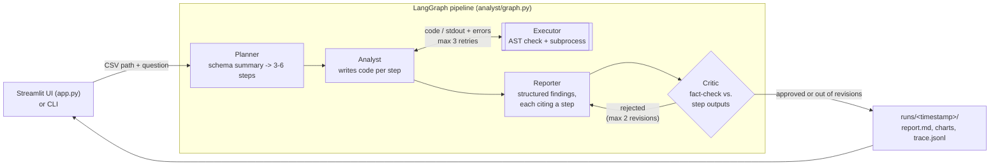

# Multi-Agent Data Analyst

Upload a CSV and ask a question in plain English ("Why did sales drop in March?"). A team
of LLM agents plans the analysis, writes and runs real pandas/scipy code against the
data, writes up the findings with charts, and has every claim fact-checked against the
computed numbers before you see it. The LLM never reads the full dataset. It sees only
a compact schema summary, and the only evidence the report may use is the JSON printed
by code that actually ran. You can use it through a Streamlit chat UI that shows each
agent's progress live, or from the command line. Either way, each run saves a markdown
report, the chart PNGs and a step-by-step trace.

## Quick start

```
pip install -r requirements.txt
.env      # then fill in ANTHROPIC_API_KEY and MODEL_NAME

streamlit run app.py        # web UI
```

### Web UI

- **Sidebar:** upload a CSV. Below the uploader, the four agents are listed with a live
  status (⚪ waiting, ⏳ running, ✅ done) and a one-line note on what each produced,
  e.g. "planned 4 steps" or "rejected: 1 issue(s)".
- **Chat:** ask a question. The answer (short answer, key findings, statistical tests,
  limitations) and its charts appear in the chat. Earlier questions stay on the page.
- The uploaded file is saved to `uploads/`, because the generated code needs a file path.
  Uploading a different CSV clears the chat.
- Each question is a separate analysis: a follow-up question does not see the previous answer.

## Architecture



All agents share one state dict (`analyst/state.py`). `stream_analysis()` in
`analyst/graph.py` yields the state after each agent finishes. The UI uses this to update the
agent panel, and `run_analysis()` (used by the CLI) simply runs the stream to the end.

| File | Role |
|------|------|
| `app.py` | Streamlit UI: upload, chat, live agent panel |
| `analyst/__main__.py` | CLI entrypoint |
| `analyst/graph.py` | LangGraph wiring, the "revise or finish" routing, `stream_analysis` / `run_analysis` |
| `analyst/state.py` | Shared state (TypedDict) passed between nodes |
| `analyst/planner.py` | Schema summary + question -> 3-6 analysis steps (never sends the full CSV) |
| `analyst/analyst.py` | LLM writes pandas/scipy code per step; runs it; feeds errors back (max 3 retries) |
| `analyst/executor.py` | Runs LLM-generated code with basic safeguards (see Limitations) |
| `analyst/reporter.py` | LLM returns structured findings (each citing a step id); Python renders `report.md` |
| `analyst/critic.py` | LLM fact-checks every claim against step outputs -> `{"approved", "issues"}` |
| `analyst/llm.py` | Anthropic SDK wrapper; `complete_json` validates replies with pydantic + one repair retry |
| `analyst/trace.py` | Appends one JSON line per agent step to `runs/<timestamp>/trace.jsonl` |


## Design decisions

### Why separate agents

The work splits into three jobs that fail in different ways, so each gets its own agent
with a narrow prompt and its own output check:

1. **Planner** decides *what* to compute. It only sees a schema summary (dtypes, null counts,
   first rows, `describe()`, distinct values of low-cardinality columns), so it plans with
   real column names without the full data ever being sent to the LLM.
2. **Analyst** turns each step into code and runs it. If the code fails, the error goes back
   to the LLM to fix (max 3 retries). The step is marked failed after that instead of being guessed.
3. **Reporter** explains the results. It returns JSON, not markdown, and must cite a step id
   for every finding. Python renders the report, so the sections, chart embeds, failed-step
   list and missing-value notes are always present and correct.

One prompt doing all three would mix planning, coding and writing. That makes it harder to
see which part went wrong, and it lets the model write numbers it never computed.

### Why a critic loop

The Reporter can still overstate things, for example by turning a correlation into a cause
or rounding a number differently. A fourth agent, the **Critic**, checks every number and
conclusion against the same step outputs the Reporter saw. A rejected report goes back to
the Reporter with the list of issues (max 2 revisions). If it is still rejected after that,
the remaining issues are appended to the report under "Unresolved reviewer caveats", not
dropped silently. The loop is capped so a run always ends.

This complements the hard checks in code:

1. Only successful step outputs count as evidence.
2. Citing a failed or unknown step id is rejected in code (then repaired once by the LLM).
3. The Analyst's output is rejected if it contains prose (strings of 8+ words). This was
   added after a real run where an LLM-written "note" in a step's output was treated as
   evidence by the Critic.

### Why a statistical test

"Sales dropped in March" might just be noise. When a question is about a change or a
comparison, the Planner must include at least one statistical test step (e.g. Welch t-test or
Mann-Whitney U, target period vs. prior periods). If its plan has none, the plan is sent back.
The report shows each test's p-value and whether it is significant at 5%, so the reader can
tell a real shift from random variation.

## Run output

Each run creates `runs/<timestamp>/` with `report.md`, the chart PNGs, and `trace.jsonl`
(one line per agent step / code attempt: agent, input summary, code, stdout, stderr,
error, retries, duration, token usage).

## Limitations

- **The sandbox is basic.** It is not a production-grade sandbox, and Python-level checks
  can be bypassed by a determined attacker. What it does:
  1. An AST check before running rejects dangerous imports (`os`, `subprocess`, `socket`,
     `requests`, `shutil`, `sys`, `pathlib`, `importlib`, `ctypes`, `multiprocessing`,
     `urllib`, `http`, `builtins`), `eval`/`exec`/`__import__`/`compile`, dunder attribute
     access, and `open()` for writing outside `OUTPUT_DIR`.
  2. Code runs in a separate subprocess with a 30 s timeout and a temporary working directory.
  3. Only an allowlist of environment variables is passed, so `ANTHROPIC_API_KEY` never
     reaches generated code.

  Gaps: pandas/matplotlib can still write files (`df.to_csv("x")`, `plt.savefig("x")`), and
  there are no memory limits and no network isolation. A real deployment would run generated
  code in a locked-down container (Docker or gVisor).
- **LLM-written code can still be wrong.** Code that runs without errors can still compute
  the wrong thing, e.g. a wrong filter or a wrong grouping. The Critic only checks that the
  report matches the step outputs. It cannot tell whether those outputs are correct.
- **The Critic is itself an LLM.** It can miss an unsupported claim or flag a correct one.
- **Small evaluation.** So far the system has only been checked by hand on the two datasets
  above, plus the unit tests (which use a scripted fake LLM). That is not enough to make
  claims about accuracy in general.
- **Keyword heuristic.** Whether a question needs a statistical test is decided by a keyword
  list (`planner.py`), which can miss phrasings.
- **Truncated evidence.** Step outputs are cut to 3000 characters each when shown to the
  Reporter and Critic (`MAX_EVIDENCE_CHARS`), so very large tables are only partly visible to them.
- **No chat memory.** Each question in the UI is a fresh analysis.
- **Sequential steps.** Steps run one after another, and each one re-reads the CSV.

## What I'd improve

- **Real sandbox:** run generated code in a container with no network, a read-only filesystem
  and CPU/memory limits.
- **Bigger evaluation set:** CSVs with planted, known answers (like `sales.csv`), scored
  automatically, to measure accuracy rather than spot-check it.
- **Check the code, not just the report:** e.g. have the Critic also review the step code, or
  cross-check key numbers with a second independent computation.
- **Follow-up questions:** pass earlier questions and step results into the next run so the
  chat can build on previous answers.
- **Finer progress in the UI:** show each Analyst step as it runs, not just the agent as a whole.
- **Parallel steps:** run independent analysis steps at the same time.

## Sample data

`data/sales.csv` is produced by `data/generate_sales.py` (fixed seed). Ground truth:
daily sales Jan–Jun 2025 for 4 regions × 3 products. **West region units drop
to ~20% in March** (West revenue ~130k → ~26k), so total March revenue falls
~21% vs Jan–Feb. Other regions are flat. 8 `units` values are blank on purpose.

Generated code gets two variables: `CSV_PATH` and `OUTPUT_DIR`. It must print its results as
JSON to stdout and save charts as PNGs into `OUTPUT_DIR`.

## Tests

| File | Covers |
|---|---|
| `test_executor.py` | blocked imports/calls/writes, timeout, stdout on success, no secrets in env |
| `test_planner.py` | plan JSON parsing + validation, repair retry, statistical-test rule |
| `test_analyst.py` | error feedback + retries, max 3 retries then "failed", trace contents |
| `test_reporter_critic.py` | report rendering, citation checks, revision counting |
| `test_graph.py` | full pipeline on a tiny CSV reaches END (with 1 revision, and with max revisions); streaming yields agents in order |
